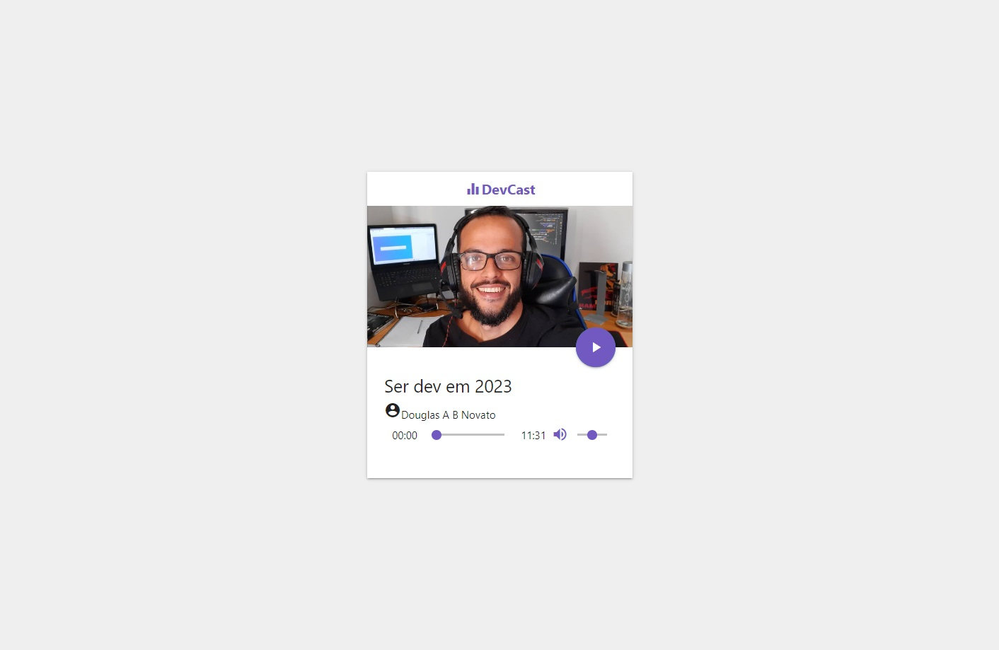
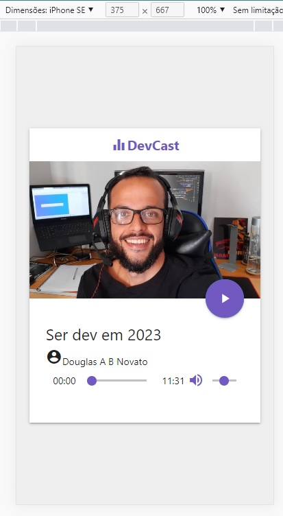

<h1 align="center">
    
</h1>

<h4 align="center"> 
	🚧 Áudio Player 🚀🚧
</h4> 

## 💻 Sobre o projeto

♻️ Áudio Player 

- Áudio player personalizado com os áudios e imagem 
 
## 🎨 Layout

- [x] Easy
- [x] Iniciar a estrutura do layout (HTML e CSS).
- [x] Criar o player de audio
- [x] Fazer o player tocar automaticamente quando a janela abrir
- [x] Ok, me arrependi, o player tocando automaticamente é horrível. Remova esta opção de autoplay
- [x] Alimentar o player com os dados de audio
- [x] Moderate
- [x] Refatorar: Criar um objeto para guardar o estado, funcionalidades e configurações do player
- [x] Quando o audio finalizar, iniciar o próximo da lista
- [x] Quando chegar no último audio, voltar a reproduzir o primeiro.
- [x] Hard
- [x] Iniciar a customização visual do player
- [x] Adicionar funcionalidade para os botões (Play/Pause, Volume, Mute e Seekbar)

### Web - v1.0

<p align="center" style="display: flex; align-items: flex-start; justify-content: center;">
  
</p>  

### Mobile - v1.0

<p align="center" style="display: flex; align-items: flex-start; justify-content: center;">
  
</p>  

## 🚀 Próximo passo

- [ ] adicionar áudios
- [ ] responsividade
- [ ] acessibilidade
- [ ] modo dark / light
- [ ] variação de cores
- [ ] função de player

## 🛠 Tecnologias

As seguintes ferramentas foram usadas na construção do projeto:

- [Css][css]: posicionamento, dimensionamento e muito mais
- [Javascript][javascript]
- [HTML][html]: estrutura e efeitos  
- [Git][git]
- [Github][github]  
- [Zeit Now](https://vercel.com/)   
- [Can I Use](https://caniuse.com)
- [Materialize CSS](https://materializecss.com)
- [Material Icons](https://material.io/resources/icons/?icon=account_circle&style=baseline)

## 🚀 Como executar o projeto

Podemos considerar este projeto como sendo com uma parte:
1. Front End  

### Pré-requisitos

Antes de começar, você vai precisar ter instalado em sua máquina as seguintes ferramentas:
[Git](https://git-scm.com), [Node.js][nodejs]. 
Além disto é bom ter um editor para trabalhar com o código como [VSCode][vscode]

### 🧭 Rodando a aplicação web (Front End)

```bash 
# Clone este repositório
$ git clone https://github.com/douglasabnovato/audio-player

# Acesse a pasta do projeto no seu terminal/cmd
$ cd audio-player  

# Execute a aplicação em modo de desenvolvimento
Open with Live Server

# A aplicação será aberta na porta:5500 - acesse http://localhost:5500

```

## 😯 Como contribuir para o projeto

1. Faça um **fork** do projeto.
2. Crie uma nova branch com as suas alterações: `git checkout -b my-feature`
3. Salve as alterações e crie uma mensagem de commit contando o que você fez: `git commit -m "feature: My new feature"`
4. Envie as suas alterações: `git push origin my-feature`
> Caso tenha alguma dúvida confira este [guia de como contribuir no GitHub](https://github.com/firstcontributions/first-contributions)


## 📝 Licença

Este projeto esta sobe a licença MIT.

Feito com ❤️ por Douglas A B Novato 👋🏽 [Entre em contato!](https://www.linkedin.com/in/douglasabnovato/)

[git]: https://git-scm.com/doc
[github]: https://docs.github.com/en
[nodejs]: https://nodejs.org/
[typescript]: https://www.typescriptlang.org/
[expo]: https://expo.io/
[reactjs]: https://reactjs.org
[rn]: https://facebook.github.io/react-native/
[yarn]: https://yarnpkg.com/
[vscode]: https://code.visualstudio.com/
[vceditconfig]: https://marketplace.visualstudio.com/items?itemName=EditorConfig.EditorConfig
[license]: https://opensource.org/licenses/MIT
[vceslint]: https://marketplace.visualstudio.com/items?itemName=dbaeumer.vscode-eslint
[prettier]: https://marketplace.visualstudio.com/items?itemName=esbenp.prettier-vscode
[rs]: https://rocketseat.com.br 
[css]: https://developer.mozilla.org/en-US/docs/Web/CSS 
[html]: https://developer.mozilla.org/en-US/docs/Web/HTML
[javascript]: https://developer.mozilla.org/en-US/docs/Web/JavaScript 

Fonte do projeto: [Mayk Brito em Criando Player de Áudio com Javascript](https://www.youtube.com/watch?v=vqrjFnq3-uo&list=WL&index=4&t=0s)
